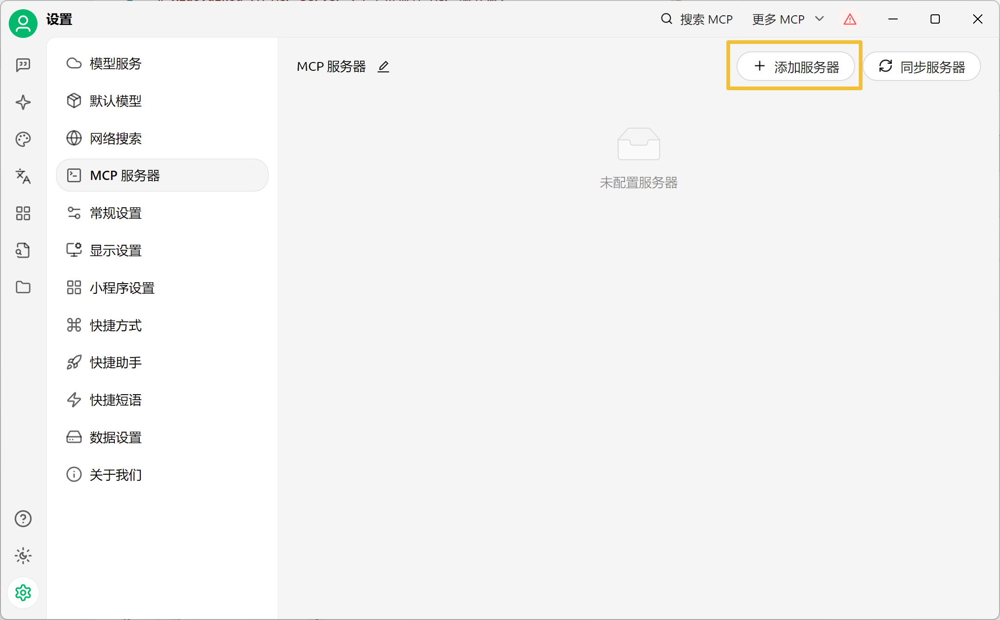
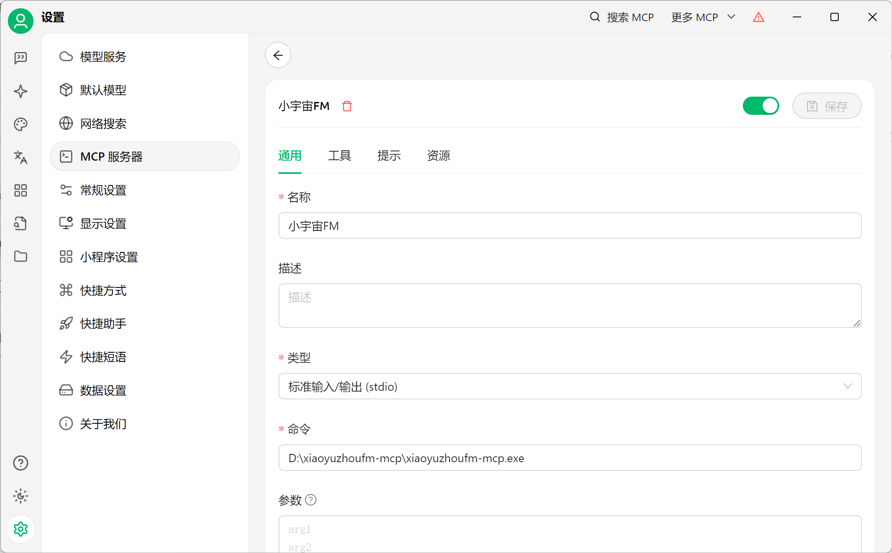
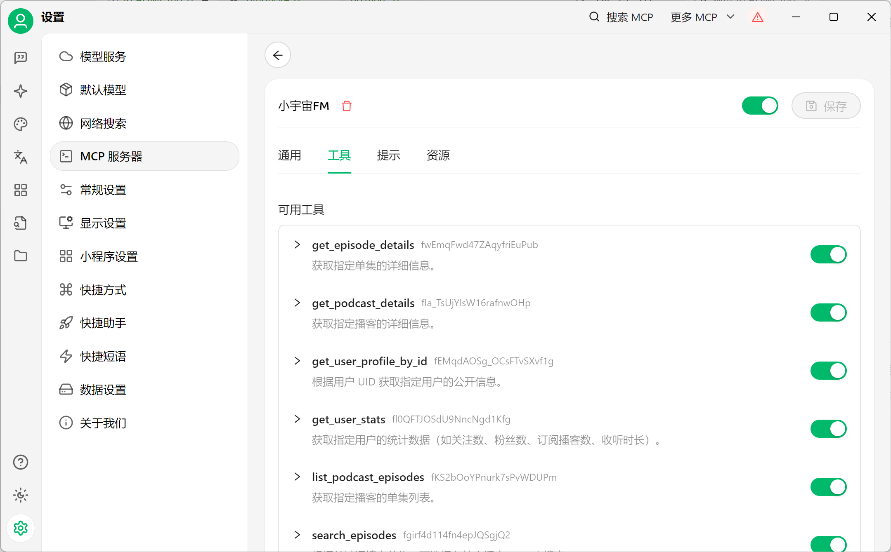
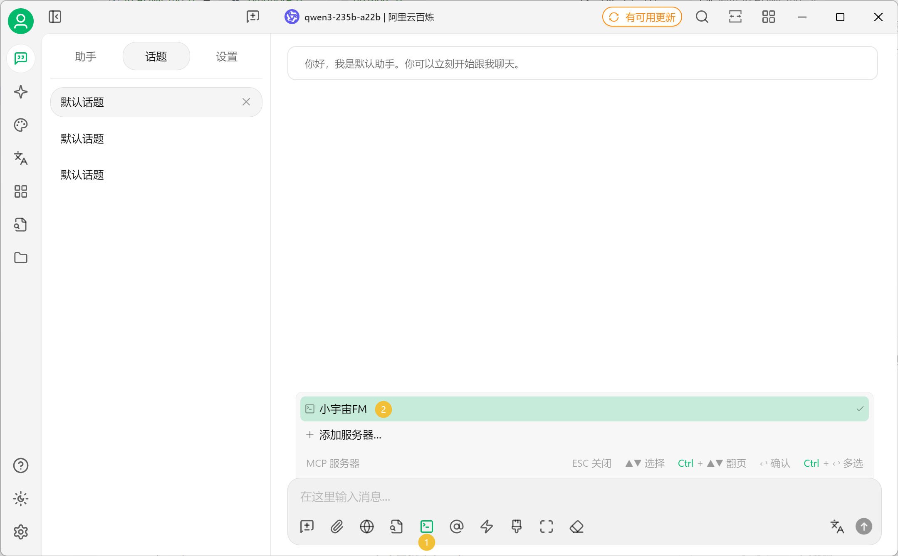
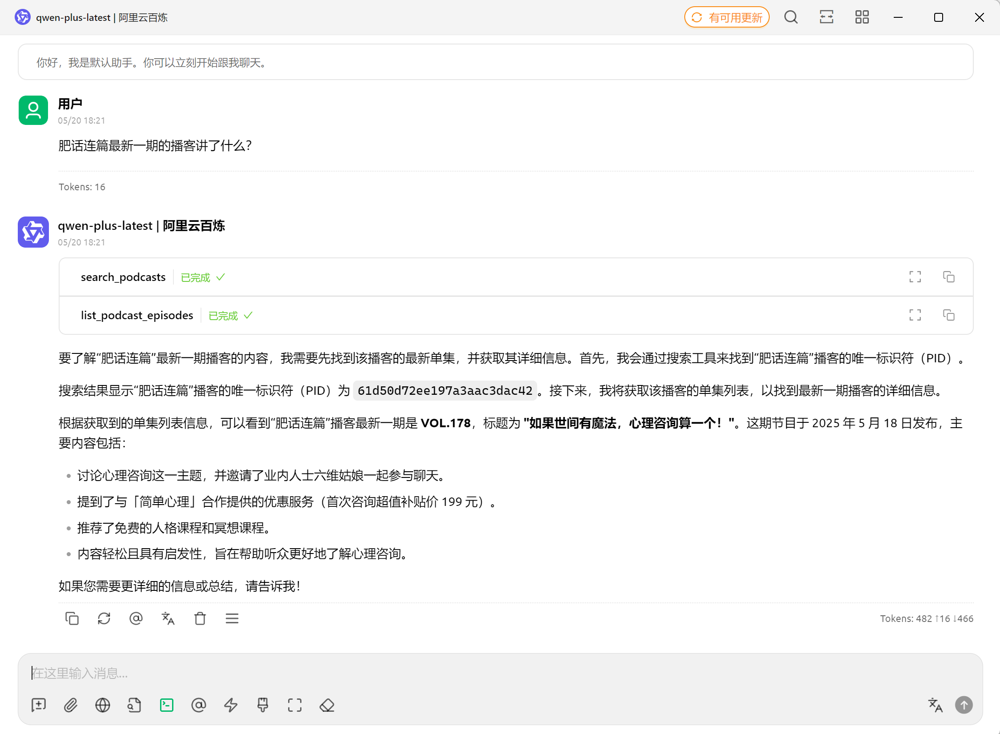

# Xiaoyuzhou FM MCP Server (小宇宙播客 MCP 服务器)

本项目用 Go 语言实现了一个 MCP (Model Context Protocol) 服务器，用于与小宇宙FM 的 API 进行交互。它允许大语言模型 (LLM) 通过 MCP 工具访问小宇宙播客的信息。

## 主要功能

*   **交互式登录**: 首次使用时通过手机号和验证码登录小宇宙账户获取 token。
*   **MCP 工具集**: 提供了一系列 MCP 工具，封装了对小宇宙 API 的调用，包括：
    *   `get_user_profile_by_id`: 获取用户公开信息。
    *   `get_user_stats`: 获取用户统计数据。
    *   `get_podcast_details`: 获取播客详细信息。
    *   `list_podcast_episodes`: 获取播客的单集列表（支持分页和排序）。
    *   `get_episode_details`: 获取单集详细信息。
    *   `search_podcasts`: 根据关键词搜索播客（支持分页）。
    *   `search_episodes`: 根据关键词搜索单集，可选在特定播客内搜索（支持分页）。
    *   `search_users`: 根据关键词搜索用户（支持分页）。

## 快速开始

### 1. 克隆仓库

```bash
git clone https://github.com/MosesHe/xiaoyuzhoufm-mcp.git
cd xiaoyuzhoufm-mcp
```

### 2. 构建

```bash
go build -o xiaoyuzhoufm-mcp.exe cmd/xiaoyuzhoufm-mcp/main.go
```
或者简单地：
```bash
go build ./cmd/xiaoyuzhoufm-mcp/...
```
这会在项目根目录下生成 `xiaoyuzhoufm-mcp.exe` (Windows) 或 `xiaoyuzhoufm-mcp` (Linux/macOS) 可执行文件。

### 3. 初始化（登录）

首次使用时，需要通过以下命令进行登录认证：

```bash
./xiaoyuzhoufm-mcp.exe init
```
或者在 Linux/macOS 上：
```bash
./xiaoyuzhoufm-mcp init
```

初始化过程将引导您：
1. 输入区号（默认 +86）
2. 输入小宇宙账号手机号码
3. 输入接收到的 4 位验证码

成功登录后，认证令牌将保存在用户主目录下的 `~/.mcp/xiaoyuzhoufm-mcp/token.json` 文件中。

### 4. 使用服务器（以Cherry Studio为例）

1. 打开Cherry Studio，进入设置—— MCP 服务器，点击右上角添加服务器。


2. 在设置界面中填写名称，类型选择 标准输入/输出 (stdio)，命令输入先前步骤中构建好的可执行文件路径，打开右上角的 MCP Server 开关。


3. 点击"工具"选项卡，若出现工具列表则已设置成功。


4. 在对话窗口选择本MCP Server，开始对话。



服务器启动时会自动从 `~/.mcp/xiaoyuzhoufm-mcp/token.json` 加载认证令牌。如果令牌不存在或已失效，服务器会提示您先运行初始化命令。

### 5. 令牌管理

- 令牌文件存储在：`~/.mcp/xiaoyuzhoufm-mcp/token.json`
- 令牌格式为 JSON，包含以下字段：
  ```json
  {
    "access_token": "...",
    "refresh_token": "...",
    "uid": "...",
    "nickname": "...",
    "last_updated_timestamp": 1234567890
  }
  ```
- 如果接近过期，令牌会在使用时自动刷新

## 项目结构

```
.
├── cmd/xiaoyuzhoufm-mcp/
│   └── main.go                 # 主应用程序入口点
├── internal/
│   ├── constants/
│   │   └── constants.go        # 定义项目中使用的常量 (如 API Base URL)
│   ├── server/
│   │   └── server.go           # MCP 服务器实现，包括工具注册和请求处理
│   ├── tools/                  # MCP 工具的实现逻辑
│   │   ├── podcast_tool.go
│   │   ├── search_tool.go
│   │   └── user_profile_tool.go
│   └── xyzclient/              # 用于与小宇宙 API 交互的客户端逻辑
│       ├── auth_api.go         # 认证相关 API 调用
│       ├── http.go             # HTTP 客户端封装
│       ├── podcast_api.go      # 播客相关 API 调用
│       ├── profile_api.go      # 用户资料相关 API 调用
│       ├── search_api.go       # 搜索相关 API 调用
│       ├── token.go            # Token 管理
│       └── types.go            # API 请求和响应的结构体定义
├── .gitignore
├── go.mod
├── go.sum
├── README.md                   
```

## TODO

- [ ] 优化内部错误重试
- [ ] 优化工具描述
- [ ] 精简返回给模型的响应内容，节省 Token
- [ ] 扩展现有工具集

## 许可证

本项目基于 [MIT License](LICENSE) 

## 免责声明

本项目仅用于学习和研究目的。请遵守所有适用的法律以及小宇宙播客的服务条款。